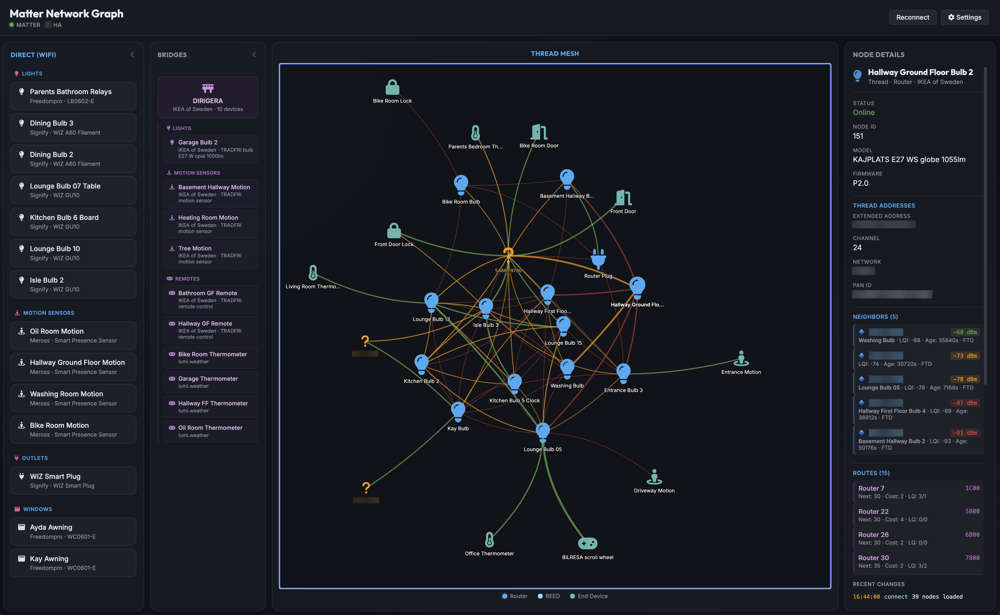

# Matter Network Graph

A web-based visualization tool for Matter/Thread smart home networks. Connects to [Python Matter Server](https://github.com/home-assistant-libs/python-matter-server) and [Home Assistant](https://www.home-assistant.io/) to display your network topology, device relationships, and signal strengths in real-time.



## Features

- **Interactive Network Visualization** - Graph view of your Thread mesh network using Vis.js with physics-based layout
- **Device Categorization** - Separates WiFi devices, Thread Border Routers (bridges), and Thread mesh devices
- **Signal Strength Indicators** - Color-coded connections showing RSSI/LQI between devices
- **Thread Diagnostics** - View neighbor tables, route tables, and device roles (Router, REED, End Device)
- **Unknown Device Detection** - Identifies devices seen in neighbor tables but not registered with Matter Server
- **Real-time Updates** - Live connection to Matter Server with automatic refresh on device changes
- **Home Assistant Integration** - Pulls friendly device names from your HA device registry
- **Change Log** - Sidebar showing recent device updates and connection events

## Usage

### 1. Clone the Repository

```bash
git clone https://github.com/yourusername/matter_graph.git
cd matter_graph
```

### 2. Open in Browser

Simply open `index.html` in Chrome (or any modern browser):

```bash
# macOS
open index.html

# Linux
xdg-open index.html

# Windows
start index.html
```

Or drag and drop the file into your browser.

### 3. Configure Connection

1. Click the **gear icon** in the top-right corner to open Settings
2. Enter your **Host** (IP address or hostname of your Home Assistant/Matter Server)
3. Enter the **Port** for Python Matter Server (default: `5580`)
4. Enter your **Home Assistant Long-Lived Access Token** (create one in HA under Profile > Security > Long-Lived Access Tokens)
5. Click **Save**

The app will automatically connect and display your network.

## Requirements

- [Python Matter Server](https://github.com/home-assistant-libs/python-matter-server) running and accessible
- [Home Assistant](https://www.home-assistant.io/) with Matter integration (optional, for friendly device names)
- Modern web browser with WebSocket support

## How It Works

The app connects via WebSocket to:

1. **Python Matter Server** (`ws://host:5580/ws`) - Retrieves all Matter node data including Thread diagnostics
2. **Home Assistant** (`ws://host:8123/api/websocket`) - Fetches device registry for friendly names

It then:
- Parses Thread neighbor tables to build network topology
- Calculates signal strength between devices
- Renders an interactive graph visualization
- Updates in real-time as devices change

## UI Overview

| Panel | Description |
|-------|-------------|
| **WiFi Devices** | Standalone Matter devices connected via WiFi (not Thread) |
| **Bridges** | Thread Border Routers that bridge Thread and WiFi networks |
| **Thread Mesh** | Interactive graph showing Thread network topology |
| **Unknown Devices** | Devices seen in neighbor tables but not in Matter Server |
| **Change Log** | Recent updates and connection events |

Click any device to view detailed information including vendor, model, firmware, Thread role, neighbor table, and more.

## Color Legend

### Nodes
- **Blue** - Thread Router
- **Light Blue** - REED (Router-Eligible End Device)
- **Teal** - End Device
- **Purple** - Bridged Device
- **Orange** - Unknown Device

### Edges
- **Green** - Strong signal (RSSI > -70 dBm)
- **Orange** - Medium signal (-70 to -85 dBm)
- **Red** - Weak signal (< -85 dBm)

## Development

### Utility Scripts

**Dump Matter Server data to JSON:**
```bash
npm install
node fetch_data.js
```

**Analyze Thread topology (Python):**
```bash
python analyze_thread.py
```

## License

MIT
